# Complete Series V2

Complete Series finds gaps in audiobook series stored in Audiobookshelf. It compares the books you own with selected catalogues and shows which series may be incomplete.

V2 rewrites the original project as a TypeScript and React browser app. It removes the PHP layer, adds clearer review and debug tools, and no longer depends on one third-party metadata provider.

## Repository Migration

V2 was built in a separate repository so V1 could remain available while the rewrite was tested. This repository now contains V2, and V1 is deprecated because its third-party metadata-provider flow is no longer a trustworthy release path.

## Highlights

- Audiobookshelf is contacted directly from the browser.
- Audible is the default and recommended metadata provider.
- Apple Books, Google Books, and Open Library can be selected as experimental review providers.
- Matching can use ASIN, SKU, ISBN, title, subtitle, author, narrator, series name, and series position evidence.
- Series that cannot be matched confidently are shown in Review instead of being silently skipped.
- Hidden items, manual matches, filters, debug output, provider cache data, and results can be exported.

## Screenshots

The screenshots below use a curated demo Audiobookshelf library. The server URL shown in screenshots is illustrative.

### Login

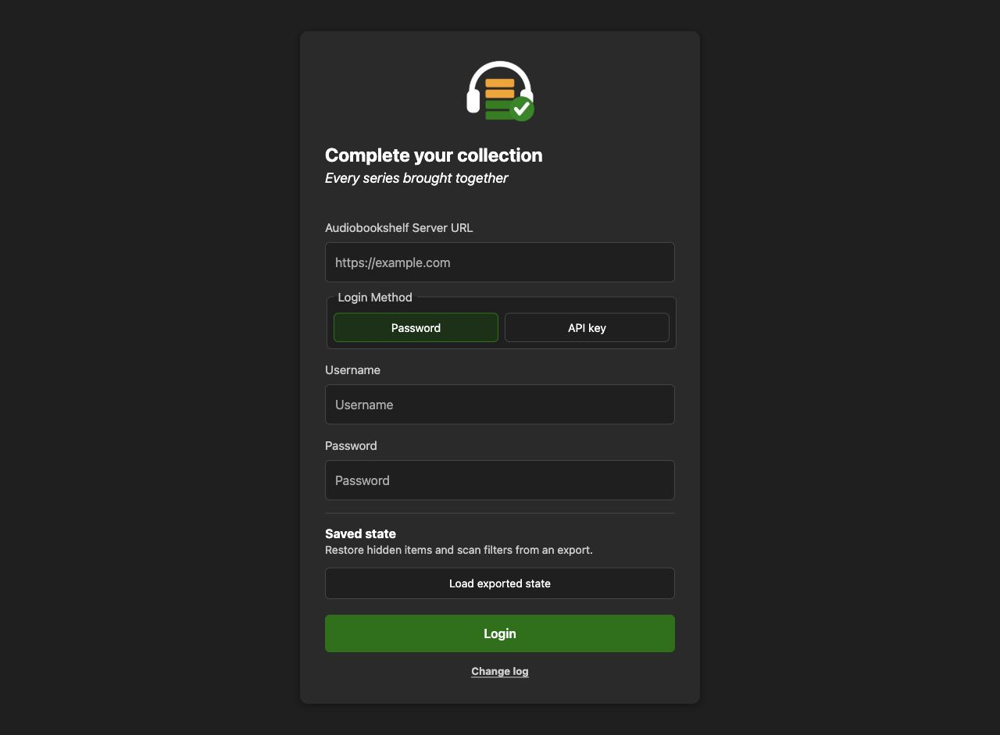

### Scan Setup

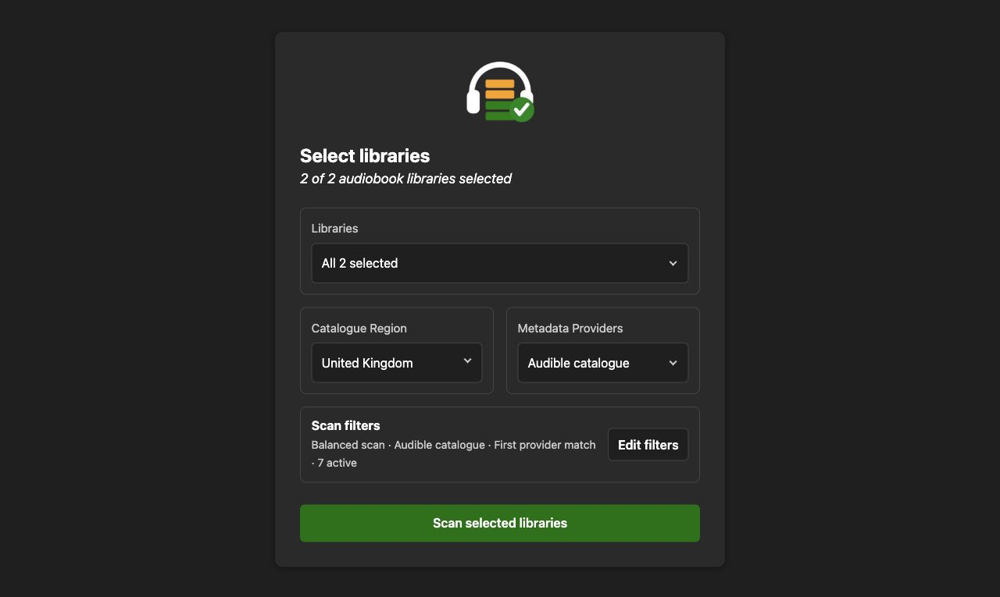

### Results

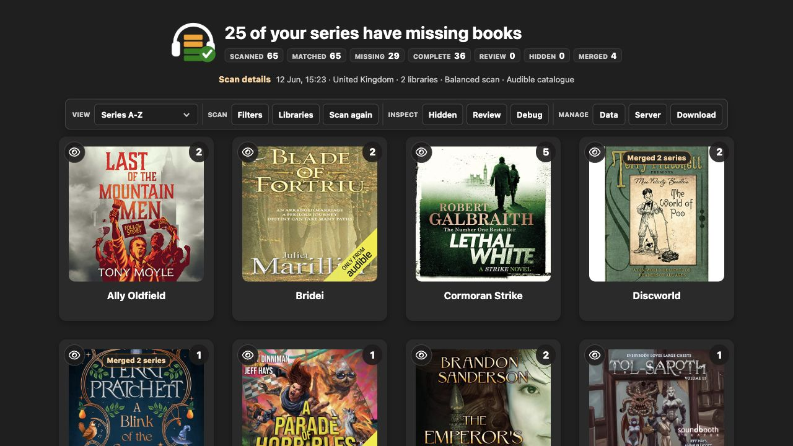

### Missing Book Details

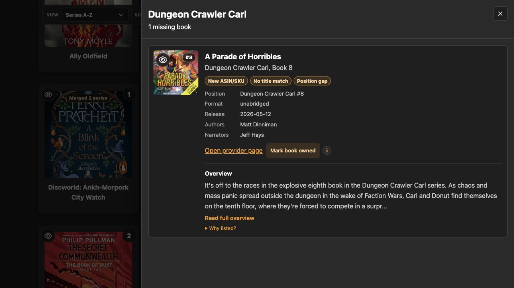

### Filters

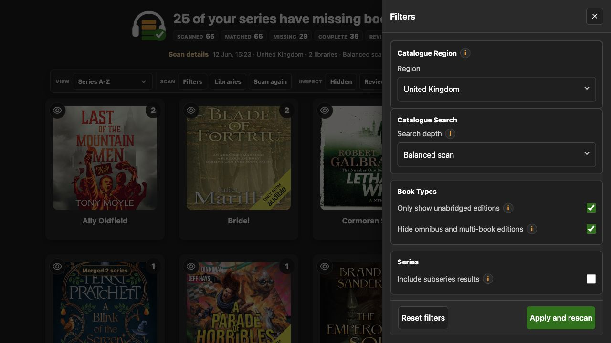

### Libraries

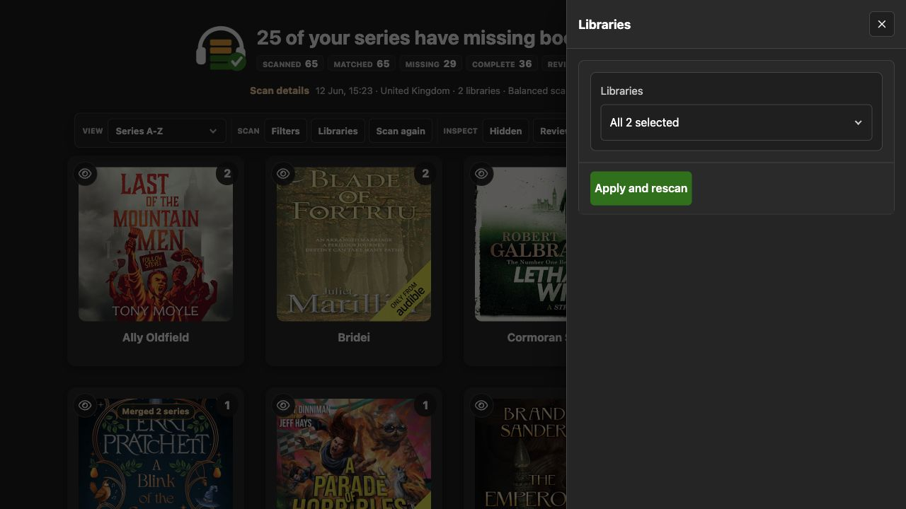

### Review

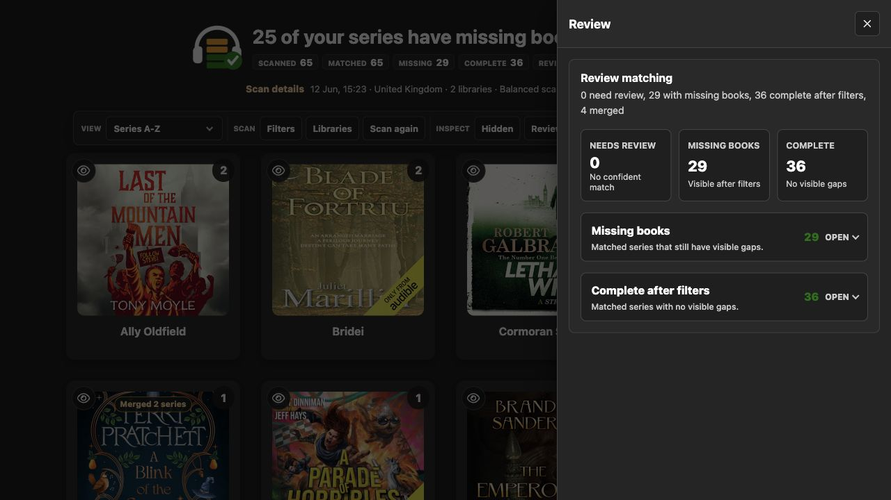

### Debug

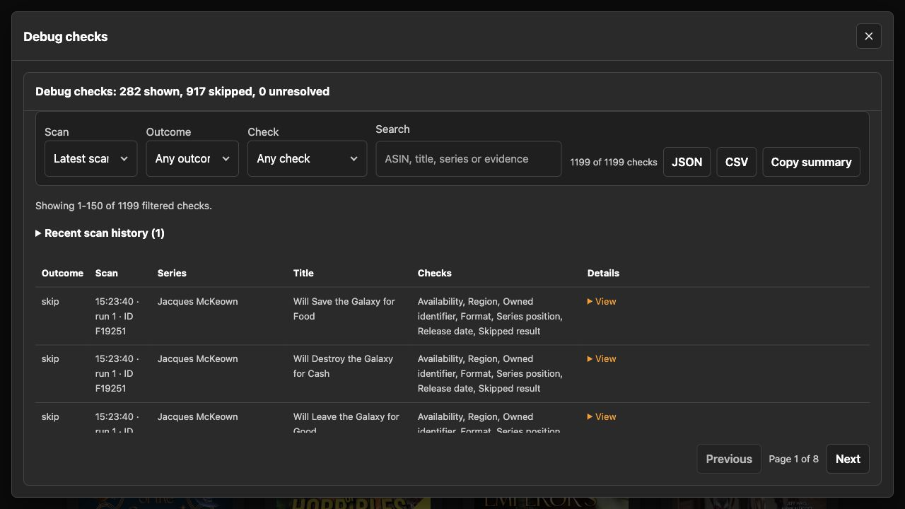

### Hidden Items

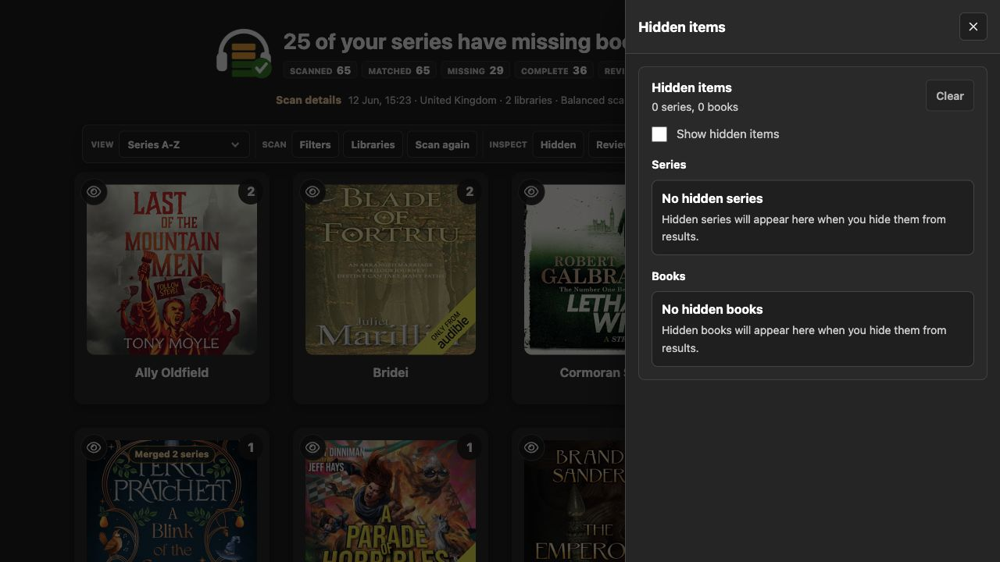

### Data

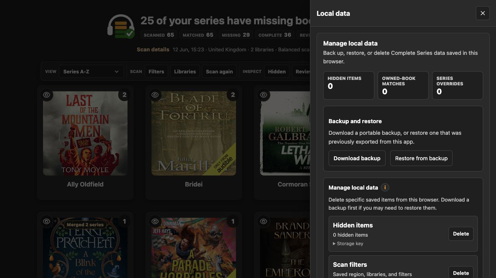

### Server

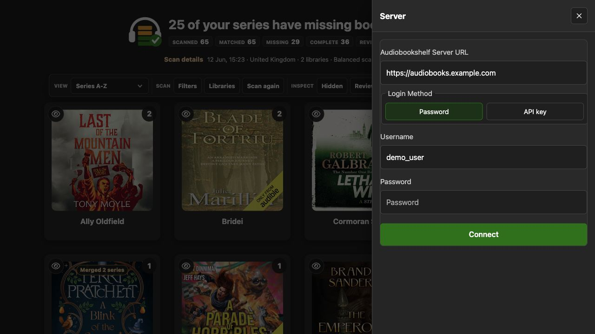

### Download

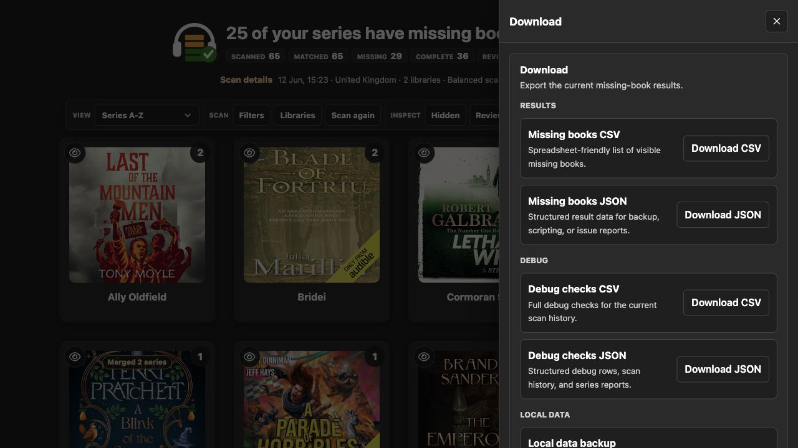

## Local Development

Install dependencies and start the development server:

```bash
npm install
npm run dev
```

Open `http://127.0.0.1:5173/` or `http://localhost:5173/`.

Before committing changes, run:

```bash
npm run typecheck
npm run test
npm run coverage
npm run build
```

Coverage is expected to stay above `80%` for statements and lines.

## Google Books Key

Google Books works best with an API key. Users can enter a key in the scan filters, or a deployment can provide a default key at build time.

For local development, copy `.env.example` to `.env.local` and set:

```bash
VITE_GOOGLE_BOOKS_API_KEY=your_key_here
```

Browser apps cannot keep this key secret. Treat it as a quota and identification key, not as a private credential.

## Hosting

Build the static app:

```bash
npm run build
```

Serve the generated `dist` directory from a web server. Complete Series is a browser app, but the host also needs two same-origin provider routes:

- `/api/audible/{region}` forwards public Audible catalogue requests.
- `/api/apple-books` forwards Apple Search API requests when Apple blocks direct browser reads.

These routes are hosted by the same web server that serves Complete Series. They are not a third-party metadata service.

The included Vite, NGINX, and cPanel Node configurations strip credential, cookie, origin, referrer, API-key, and forwarding headers before provider requests are sent onwards. Audiobookshelf usernames, passwords, API keys, bearer tokens, server URLs, library data, hidden items, manual matches, saved filters, debug history, local exports, and Google Books keys are not sent through the Audible or Apple Books provider routes.

For full setup, hosting, and data-forwarding details, see [Setup and configuration](docs/setup-configuration.md).

### cPanel

If your cPanel host provides Node.js application support, use `app.js` as the startup file after building the app. It serves `dist/` and provides the restricted Audible and Apple Books provider routes without needing NGINX.

Upload `app.js`, `dist/`, `server/cpanel-server.mjs`, `package.json`, and `package-lock.json` to the cPanel app root, then set the startup file to:

```text
app.js
```

Static-only cPanel hosting will load the interface but will not support Audible or Apple Books scans. See [cPanel hosting](docs/setup-configuration.md#cpanel-hosting) for the full checklist.

## Docker

Docker is optional. The provided image builds the Vite app and serves the static bundle with NGINX:

```bash
docker compose up --build
```

The app will be available at `http://127.0.0.1:8080/`.

The published container image is available from GitHub Container Registry:

```bash
docker run --rm -p 8080:80 ghcr.io/xfriedspudx/completeseries:latest
```

An Unraid template is available at [templates/complete-series.xml](templates/complete-series.xml). It uses Docker bridge networking, host port `8080`, and container port `80`.

To bake in a default Google Books key for the browser app, set `VITE_GOOGLE_BOOKS_API_KEY` before building. Users can still enter their own key in the scan filters.

Docker validation steps are listed in [Setup and configuration](docs/setup-configuration.md#docker-validation-checklist).

## Project Structure

```text
src/
  app/                 React app shell and frontend feature folders
    changelog/         Landing-page change log
    components/        Shared controls and display components
    debug/             Small debug display helpers used by results
    hooks/             Shared React hooks
    results/           Results grid, drawers, exports, and missing-book detail
    review/            Review cards, evidence, and manual series overrides
    setup/             Login, library selection, scan filters, and progress
    storage/           Browser storage, local data tools, and hidden items
  cache/               Shared cache interfaces
  domain/              Matching, filtering, ownership, and normalisation
  features/            Scan and debug workflows
  fixtures/            Small datasets for tests and UI previews
  integrations/        Audiobookshelf and metadata integrations
    metadata/          Provider registry and shared metadata helpers
      appleBooks/      Apple Books result interpretation helpers
      cache/           Persistent and in-memory provider response caches
      googleBooks/     Google Books result interpretation helpers
      openLibrary/     Open Library result interpretation helpers
  shared/              Small shared UI components
```

## Documentation

- [Setup and configuration](docs/setup-configuration.md)
- [Metadata provider architecture](docs/provider-architecture.md)
- [Change log](CHANGELOG.md)
